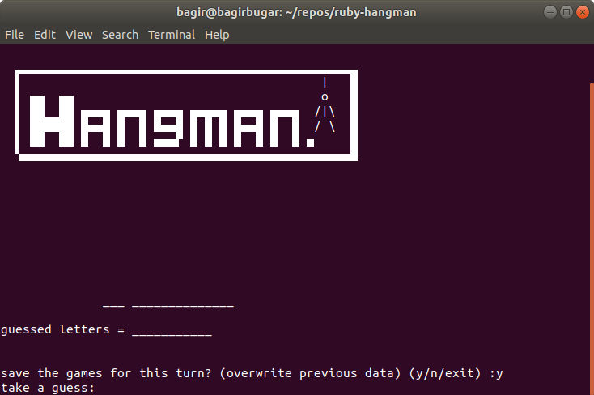

# Ruby Hangman 

 console ruby-based hangman game

cant call instance method from class and cant call class methods from object, without creating a new object

cannot include a module or call a module's method from a class methods, without creating a new object.

to method inside a class or module, the order of methods doesnt matter